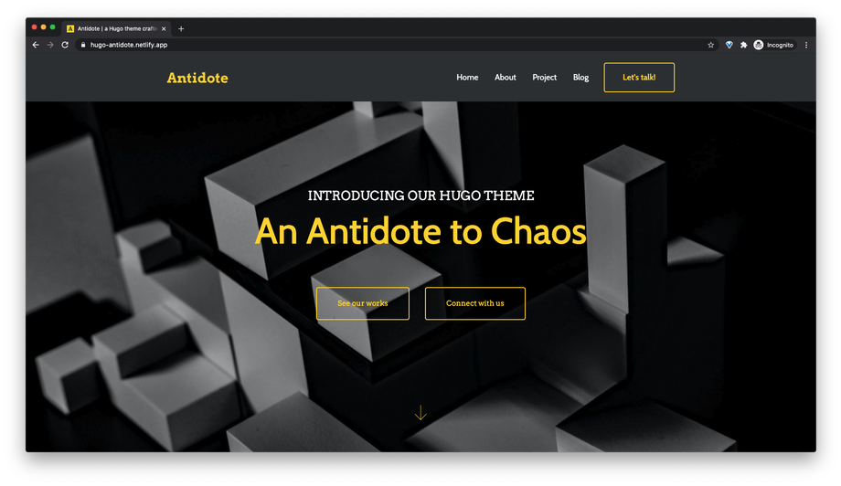
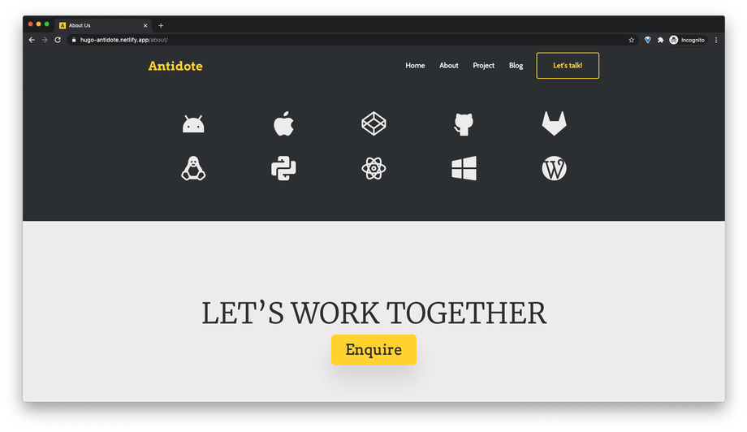
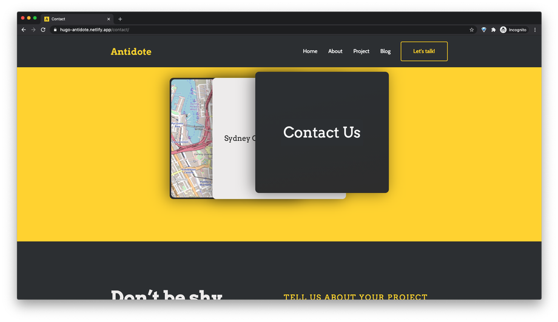

<h1>Antidote</h1>

Antidote is a customized Hugo theme based on [Roxo](https://github.com/StaticMania/roxo-hugo).

Demo: [hugo-antidote.netlify.app](https://hugo-antidote.netlify.app/)

## Features

* Responsive Ready.
* Powered by Bootstrap 4.
* Dedicated portfolio page.
* Blog Support.
* Well formatted code.
* Easy Customization.
* Formspree Contact form.
* Crafted for Design Agency/ Portfolio

## Licensing

This Repository is licensed under the [MIT](https://github.com/StaticMania/roxo-hugo/blob/master/LICENSE) License
